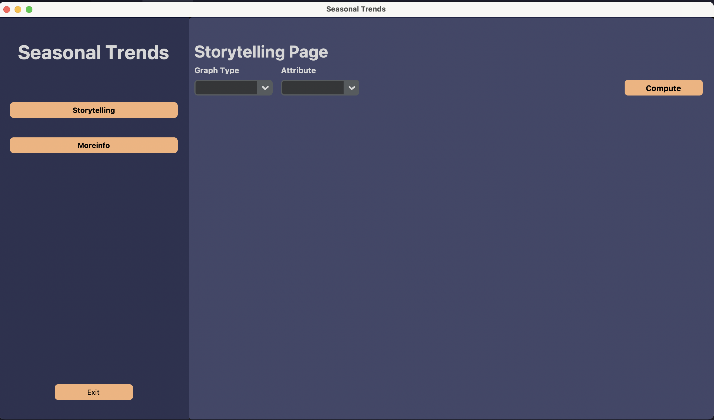
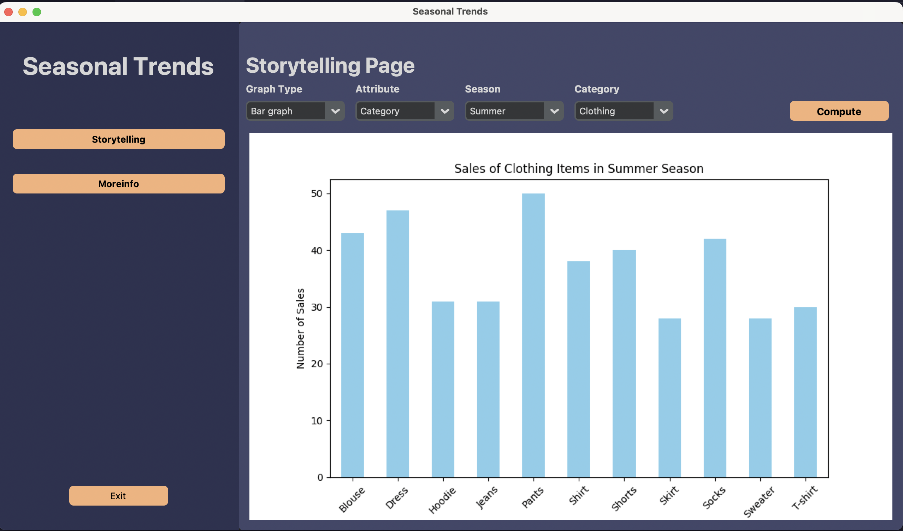
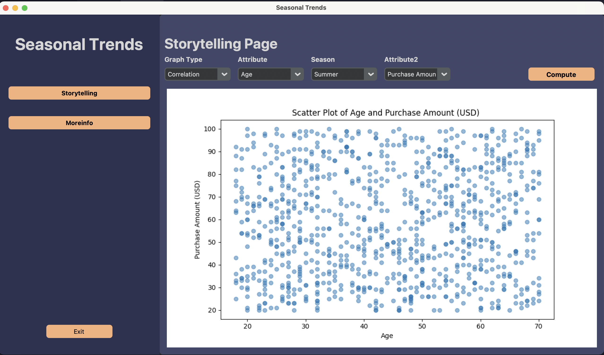
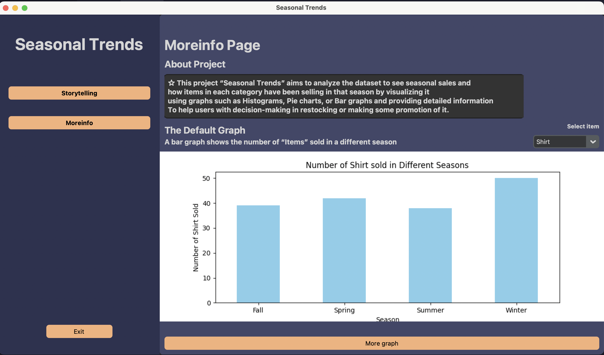
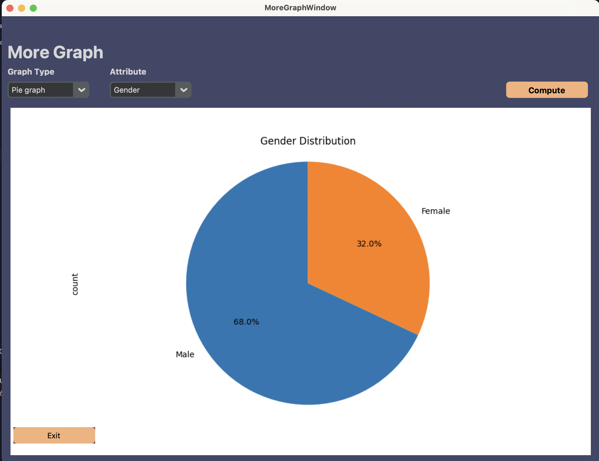
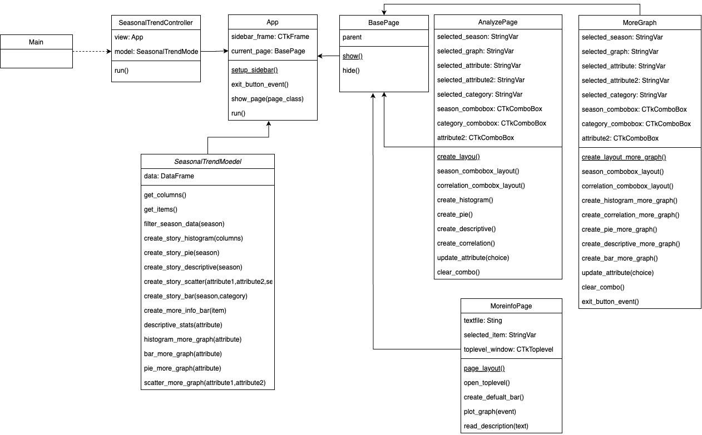

# Seasonal Trends

This project “Seasonal Trends” aims to analyze the dataset to see seasonal sales 
and how items in each category have been selling in that season by visualizing it 
using graphs such as Histograms, Pie charts, or Bar graphs and provide detailed information 
to help users with decision-making in restocking or make some promotion of it.

## Resource
The Customer Shopping Trends Dataset 
from [kaggle.com](https://www.kaggle.com/datasets/iamsouravbanerjee/customer-shopping-trends-dataset)  

## Main Features
- 2 Page
  1. Analyze Storytelling page 
 
  2.  General information - This page contains some description and default graph
  Users can see which items are selling well in the season by the visualization.
  Users can see other information that may not be related to the season like overall of it
  Ex. How many items of different colors were sold?

## Example UI

- Homepage Example

- Moreinfo Page

- Moregraph Page

## UML Class Diagram

## Installation Guide
1. Clone the project
> git clone https://github.com/Nunthapop123/Year1-project.git

2. Navigate to the project directory
> cd Year1-project

3. Install the requirements.txt
> pip install -r requirements.txt

4. Run the project
> python main.py
> 

